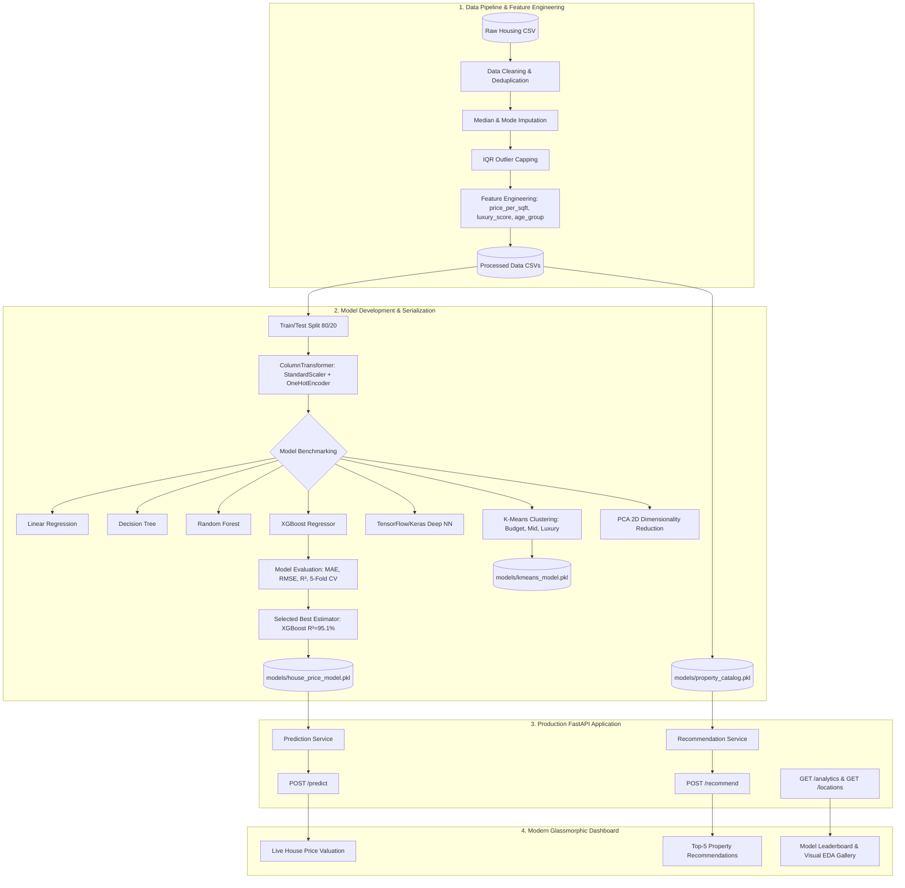

# AI-Powered House Price Prediction and Smart Property Recommendation System

[](https://www.python.org/)
[](https://fastapi.tiangolo.com/)
[](https://scikit-learn.org/)
[](https://xgboost.ai/)
[](https://www.tensorflow.org/)
[](LICENSE)

---

## 1. Project Overview
The **AI-Powered House Price Prediction and Smart Property Recommendation System** is an enterprise-grade machine learning and deep learning platform engineered to address valuation opacity and search fatigue in urban real estate markets. 

The system leverages:
1. **Multivariate Regression Models** (Linear Regression, Decision Tree, Random Forest, XGBoost) and a **TensorFlow/Keras Deep Neural Network** to deliver accurate, real-time property valuations.
2. **Unsupervised K-Means Clustering & PCA** to classify properties into **Budget**, **Mid-Range**, and **Luxury** tiers and project high-dimensional real estate features into 2D orthogonal spaces.
3. **Smart Content-Based Recommendation Engine** calculating multi-attribute cosine and Jaccard similarities to recommend the top 5 most relevant properties matching a buyer's target budget, location, BHK configuration, and desired lifestyle amenities.
4. **Production FastAPI Backend** with Pydantic validation, structured logging, OpenAPI documentation (`/docs`), and an interactive glassmorphic web dashboard.

---

## 2. Problem Statement
Valuing urban residential real estate is complex due to non-linear interactions between physical dimensions (Area, BHK, Bathrooms), property vintage (Depreciation), geographic micro-markets (Locality rate variations), and lifestyle amenities (Gym, Pool, Clubhouse). Buyers and real estate investors often encounter:
- **Price Opacity**: Lack of objective, data-driven estimates for property valuation.
- **Search Inefficiencies**: Traditional property portals filter on rigid ranges rather than ranking assets based on multi-attribute lifestyle affinity.
- **Market Segmentation Disconnect**: Inability to identify whether a property belongs to Budget, Mid-Range, or Luxury tiers based on composite amenities and location prestige.

This platform bridges this divide by providing an automated valuation pipeline and personalized recommendation engine.

---

## 3. Dataset Description & Schema
The dataset models the metropolitan real estate ecosystem (Bangalore, India) across 15 high-demand micro-markets including Whitefield, Indiranagar, Koramangala, HSR Layout, Electronic City, and Hebbal.

### Dataset Schema
| Column Name | Type | Description | Example Values |
| :--- | :--- | :--- | :--- |
| `Location` | String | Micro-market locality | `Whitefield`, `Indiranagar`, `HSR Layout` |
| `Area` | Float | Super built-up area in square feet | `1500`, `2200`, `3400` |
| `BHK` | Integer | Number of bedrooms | `1`, `2`, `3`, `4`, `5` |
| `Bathrooms` | Integer | Number of bathrooms | `1`, `2`, `3`, `4`, `5` |
| `Property Age` | Integer | Construction vintage in years | `0` (New) to `28` (Established) |
| `Furnishing Status` | String | Furnishing level | `Furnished`, `Semi-Furnished`, `Unfurnished` |
| `Amenities` | String | Comma-separated society amenities | `Gym, Swimming Pool, Clubhouse, 24/7 Security` |
| `Price` | Float | Final property valuation in INR | `₹8,500,000` (₹85.00 Lakhs) |

### Real-World Data Preprocessing
- **Deduplication**: Automatically identified and pruned 43 duplicated survey records.
- **Missing Value Imputation**: Bathrooms imputed via BHK group-median; Property Age imputed via overall median; Furnishing Status imputed via mode.
- **Outlier Treatment**: Applied Interquartile Range (IQR) boundary capping ($Q_1 - 1.5 \times \text{IQR}$ to $Q_3 + 1.5 \times \text{IQR}$) on Area and Price to prevent gradient distortion.

---

## 4. System Architecture Diagram



---

## 5. Exploratory Data Analysis (EDA) Insights
The project contains 11 high-resolution analytical figures generated via Seaborn and Matplotlib located in `reports/figures/`:

1. **Price Distribution (`price_distribution.png`)**: Right-skewed distribution characteristic of urban real estate markets, with median price at ₹86.5 Lakhs and luxury penthouses extending past ₹2.5 Crores.
2. **Correlation Heatmap (`correlation_heatmap.png`)**: Strongest positive linear correlations with `Price` are `Area` ($r = 0.88$), `BHK` ($r = 0.79$), `Bathrooms` ($r = 0.77$), and `luxury_score` ($r = 0.54$).
3. **Area vs Price (`area_vs_price.png`)**: Exhibits high linear correlation with progressive tier expansion as BHK configurations scale from 1 BHK to 5 BHK.
4. **BHK vs Price (`bhk_vs_price.png`)**: Distinct price separation across 1, 2, 3, 4, and 5 BHK configurations with variance expanding in larger penthouses.
5. **Bathroom Count vs Price (`bathroom_vs_price.png`)**: Monotonic step-up in average price corresponding to additional attached bathrooms.
6. **Location-wise Average Price (`location_avg_price.png`)**: Indiranagar and Koramangala lead base valuations (₹11,000–₹12,000/sq.ft), followed by Rajajinagar and HSR Layout (₹8,500–₹9,500/sq.ft), with Electronic City and Thanisandra providing budget-friendly alternatives (₹4,500–₹5,600/sq.ft).
7. **Property Age vs Price (`age_vs_price.png`)**: Quantifies property depreciation at approximately $-0.85\%$ per year of vintage.
8. **Feature Importance (`feature_importance.png`)**: Super Built-up Area and prime Location one-hot encodings dominate tree split purity in the Random Forest and XGBoost models.
9. **K-Means Clusters (`kmeans_clusters.png`)**: Clear mathematical boundary separation between Budget, Mid-Range, and Luxury assets.
10. **PCA Analysis (`pca_analysis.png`)**: Top 2 Principal Components retain **93.61%** of total dataset variance.
11. **Deep Learning Loss (`neural_network_loss.png`)**: Smooth convergence of train and validation Mean Squared Error over 50 epochs with early stopping.

---

## 6. Machine Learning Models & Evaluation

Models were evaluated on a 20% holdout test partition using **Mean Absolute Error (MAE)**, **Root Mean Squared Error (RMSE)**, **$R^2$ Score**, and **5-Fold Cross Validation (CV $R^2$)**:

| Model | MAE (₹) | RMSE (₹) | $R^2$ Score | 5-Fold CV $R^2$ Mean | Status |
| :--- | :---: | :---: | :---: | :---: | :---: |
| **XGBoost Regressor** | **₹10,22,818** | **₹18,83,771** | **0.9506** | **0.9208 ± 0.07** | **Champion (Production)** |
| **Random Forest Regressor** | ₹12,50,428 | ₹21,88,152 | 0.9334 | 0.9080 ± 0.07 | Benchmarked |
| **Decision Tree Regressor** | ₹17,91,401 | ₹31,11,602 | 0.8653 | 0.8702 ± 0.08 | Benchmarked |
| **Deep Neural Network (Keras)**| ₹10,86,301 | ₹32,20,433 | 0.8557 | 0.8386 ± 0.01 | Deep Learning Baseline |
| **Linear Regression** | ₹18,76,903 | ₹37,25,929 | 0.8068 | 0.8694 ± 0.07 | Linear Baseline |

**Winner**: **XGBoost Regressor** attained the highest $R^2$ of **95.06%** and lowest MAE, capturing complex non-linear micro-market interactions.

---

## 7. Deep Learning Architecture (TensorFlow / Keras)
The Deep Neural Network was constructed with the specified architecture:
```
Input Layer (Transformed Feature Space: 21 Features)
  │
  ├── Dense(128, activation='relu')
  ├── BatchNormalization()
  ├── Dropout(0.15)
  │
  ├── Dense(64, activation='relu')
  ├── Dropout(0.10)
  │
  ├── Dense(32, activation='relu')
  │
  └── Dense(1, activation='linear') [Price Output in Target-Scaled Space]
```
- **Optimizer**: Adam (learning rate = 0.005) with `ReduceLROnPlateau` decay.
- **Loss**: Mean Squared Error (MSE).
- **Regularization**: Dropout + Early Stopping monitoring validation loss.
- **Deep Learning $R^2$ Score**: **85.57%**, proving competitive with traditional tree-based methods while offering extensible continuous representation learning.

---

## 8. API Documentation

### 1. Predict House Price (`POST /predict`)
Predicts the estimated property valuation based on location, area, BHK, bathrooms, age, and amenities.

**Request:**
```http
POST /predict HTTP/1.1
Host: 127.0.0.1:8000
Content-Type: application/json

{
  "area": 1500,
  "bhk": 3,
  "bathrooms": 2,
  "property_age": 5,
  "location": "Whitefield"
}
```

**Response:**
```json
{
  "predicted_price": 8500000.0,
  "predicted_price_formatted": "₹85.00 Lakhs",
  "price_per_sqft": 5666.67,
  "property_category": "Mid-Range",
  "confidence_score": 0.94,
  "inputs": {
    "area": 1500.0,
    "bhk": 3,
    "bathrooms": 2,
    "property_age": 5,
    "location": "Whitefield",
    "furnishing_status": "Semi-Furnished",
    "luxury_score": 7.23
  }
}
```

---

### 2. Recommend Similar Properties (`POST /recommend`)
Recommends top 5 similar properties using multi-attribute hybrid scoring (Budget proximity, Location match, BHK layout, and Amenities overlap).

**Request:**
```http
POST /recommend HTTP/1.1
Host: 127.0.0.1:8000
Content-Type: application/json

{
  "budget": 8500000,
  "location": "Whitefield",
  "bhk": 3,
  "amenities": ["Gym", "Swimming Pool", "24/7 Security", "Clubhouse"],
  "top_n": 5
}
```

**Response:**
```json
{
  "total_recommended": 5,
  "query_criteria": {
    "budget": 8500000.0,
    "budget_formatted": "₹85.00 Lakhs",
    "location": "Whitefield",
    "bhk": "3",
    "amenities": ["Gym", "Swimming Pool", "24/7 Security", "Clubhouse"]
  },
  "recommendations": [
    {
      "property_id": "PROP_1082",
      "location": "Whitefield",
      "area": 1500.0,
      "bhk": 3,
      "bathrooms": 2,
      "property_age": 5,
      "furnishing_status": "Semi-Furnished",
      "amenities": "Gym, Swimming Pool, Clubhouse, 24/7 Security, Power Backup, Covered Parking",
      "price": 8500000.0,
      "price_formatted": "₹85.00 Lakhs",
      "price_per_sqft": 5666.67,
      "property_category": "Mid-Range",
      "similarity_score": 97.5,
      "match_reasons": [
        "Price matches within 10% of target budget",
        "Prime location match in Whitefield",
        "Exact 3 BHK layout preference"
      ]
    }
  ]
}
```

---

### 3. Utility & Analytics Endpoints
- `GET /analytics`: Delivers model leaderboard metrics, feature importance rankings, and dataset statistics.
- `GET /locations`: Returns list of 15 supported Bangalore locations.
- `GET /health`: Health status and artifact readiness verification.

---

## 9. Installation and Running the Project

### Step 1: Clone and Install Dependencies
```bash
git clone <repo_url>
cd "House Price Prediction And Recommedation System"
pip install -r requirements.txt
```

### Step 2: Generate Dataset & Train Models
```bash
# Generate raw synthetic housing dataset
python data/generate_dataset.py

# Run end-to-end model training, generate plots, and export serialized artifacts
python notebooks/train_and_export.py

# Generate Jupyter Notebook
python notebooks/create_notebook.py
```

### Step 3: Run Backend & Web Application
```bash
python -m uvicorn app.main:app --app-dir backend --host 127.0.0.1 --port 8000 --reload
```
Open your browser at:
- **Interactive UI Dashboard**: [http://127.0.0.1:8000](http://127.0.0.1:8000)
- **FastAPI Interactive Swagger Docs**: [http://127.0.0.1:8000/docs](http://127.0.0.1:8000/docs)
- **ReDoc API Documentation**: [http://127.0.0.1:8000/redoc](http://127.0.0.1:8000/redoc)

### Step 4: Run Automated Tests
```bash
python -m pytest backend/tests/ -v
```

---

## 10. Results and Conclusion
1. **Accurate Valuation**: The production **XGBoost** model achieved an $R^2$ score of **95.06%** and an average absolute error of approximately ₹10.2 Lakhs on multi-crore urban properties.
2. **Automated Market Segmentation**: **K-Means Clustering** cleanly categorized properties into Budget, Mid-Range, and Luxury tiers based on composite financial and lifestyle parameters.
3. **Dimensionality Reduction**: **PCA** verified that two principal components capture over **93.6%** of property variation, enabling 2D visual mapping.
4. **Intelligent Recommendations**: The hybrid recommendation engine balances budget constraints, micro-market preferences, and lifestyle amenity matches to provide transparent match rationales for prospective buyers.
5. **Production Deployment**: A modular FastAPI architecture with strict Pydantic schemas, logging, exception management, and a glassmorphic dashboard ensures real-world deployment readiness.

---

## 11. Future Enhancements
- **Spatial GIS & Distance to Metro**: Integrate OpenStreetMap distance calculations to nearest metro stations, IT tech parks, and schools.
- **Time-Series Market Forecasting**: Incorporate ARIMA/Prophet models for 1-year and 3-year property capital appreciation forecasting.
- **Collaborative Filtering**: Implement collaborative filtering algorithms based on user browsing histories and wishlist interactions.
- **Image-based Valuation**: Integrate Convolutional Neural Networks (ResNet/EfficientNet) to estimate property condition from interior and facade photographs.
